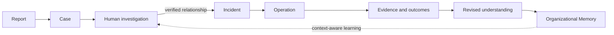

# O83 Care Architecture Foundation

Version: 2.0  
Status: Architecture Baseline

## Purpose

O83 Care is an operational memory and coordination system for juristic persons managing shared residential property. It helps people receive reports, investigate reality, coordinate work, preserve evidence, make accountable decisions, and learn without pretending that recorded information is absolute truth.

## Foundational statement

Operational Truth is **the organization's best current understanding based on verifiable evidence**. It is time-bound, revisable, and attributable. A revision adds a new understanding; it never erases the earlier observation, hypothesis, decision, or outcome.

## Invariants

1. Every incoming report creates exactly one Case. Cases are never automatically merged.
2. Investigation may associate several Cases with one verified Incident.
3. An Incident represents one verified operational event; an Operation represents work performed in response.
4. History is append-only. Corrections supersede; they do not overwrite.
5. Responsibility, Authority, Commitment, Capability, Availability, Organizational Priority, Execution Sequence, and SLA are independent concepts.
6. Human safety and harm reduction take precedence over software workflow.
7. Authorized people may act urgently before recording; reconstruction follows as soon as reasonably safe.
8. AI summarizes, compares, warns, and recommends. Humans decide, approve, verify, and remain accountable.
9. Knowledge is reusable only within declared validity context.
10. Organizational Memory is held by the Juristic Person for the long-term benefit of co-owners. All people, vendors, developers, committees, and AI are temporary stewards.

## System boundaries

O83 Care records operational coordination and organizational understanding. It does not replace emergency services, professional judgment, statutory records, financial ledgers, building-control systems, or human governance. Integrations may reference those systems while preserving provenance.

## Conceptual flow

The diagram is a flow of understanding, not a deletion pipeline. Reports, Cases, Investigation Assessments, Incidents, Operations, Evidence Items, Decision Records, Responsibility Chain entries, and Knowledge Records all remain independently identifiable in Organizational Memory.

## Accountability and understanding

The Responsibility Chain is the time-ordered set of Responsibility Ledger entries, mandates, commitments, actions, decisions, verifications, and handovers that explains who carried which duty, under what Authority, during which period. Decision Evolution is the linked sequence from observations and hypotheses through evidence, a human decision, later evidence, and revised understanding. Neither chain may be replaced by a current `owner` or `status` field.

## Stewardship and longevity

Records must remain intelligible after changes in committee, juristic company, contractors, developers, or founder. Important decisions therefore preserve context, alternatives, evidence, authority, responsibility, time, consequences, and later review. Exportability, durable identifiers, documented schemas, open formats, and independently testable retention are architectural requirements.

## Acceptance criteria

The architecture is conformant only if it preserves separate Cases, human Incident determination, immutable chronology, the Responsibility Chain, Decision Evolution, accountable Authority, emergency autonomy, context-bound knowledge, explicit AI limits, and durable organizational ownership. Related definitions are normative in [16_project_glossary.md](16_project_glossary.md); lifecycle rules are normative in [21_state_machine_catalog.md](21_state_machine_catalog.md).
