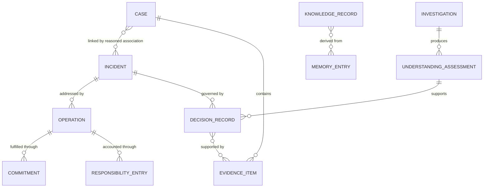

# Domain Model

Version: 2.0  
Status: Architecture Baseline

## Purpose

The domain model defines stable business concepts and aggregate boundaries. It avoids coupling operational truth to screens or database tables.

## Bounded contexts

| Context               | Primary responsibility                                                                          | Core aggregates                                               |
| --------------------- | ----------------------------------------------------------------------------------------------- | ------------------------------------------------------------- |
| Intake                | Preserve each report and dialogue                                                               | Case                                                          |
| Investigation         | Establish relationships and current understanding                                               | Investigation, Understanding Assessment, association proposal |
| Incident Management   | Preserve verified operational-event identity and Case relationships                             | Incident, Case-Incident Association                           |
| Work Management       | Plan and record response                                                                        | Operation, Commitment                                         |
| Organization          | People, roles, authority, capability                                                            | Organization, Mandate, Responsibility Ledger                  |
| Evidence              | Provenance and claim support                                                                    | Evidence Item, Evidence Package                               |
| Decision              | Accountable choices and revisions                                                               | Decision Record                                               |
| Knowledge             | Context-bound lessons                                                                           | Knowledge Record                                              |
| Organizational Memory | Govern lineage, retention, portability, and historical projections across context-owned records | Memory Manifest, Historical Projection                        |

## Core relationships

## Aggregate rules

### Case

A Case is the immutable identity of one incoming report. It owns reporter communication, reported observations, intake attachments, consent constraints, and status. Closing a Case ends its intake/service path but does not delete it or force Incident closure.

### Incident

An Incident is one human-verified operational event. It does not have a `Suspected` state: a suspected event remains within an Investigation until an authorized human verifies it. An Incident may initially have no associated Case only when created from an authorized proactive inspection or external operational signal; otherwise it is created with at least one Case association. Association and disassociation are reasoned, authorized, immutable historical actions represented by their own records.

### Investigation and Understanding Assessment

An Investigation preserves the question being examined, observations, hypotheses, evidence requests, participants, and scope. An Understanding Assessment is a versioned conclusion produced during that Investigation. It distinguishes what is known, inferred, disputed, and unknown, and may recommend Incident verification, Case association, continued investigation, or conclusion without a verified Incident. A later assessment supersedes but never edits an earlier assessment.

### Case-Incident Association

The association is not a mutable foreign key. It records Case, Incident, relationship type, relevance, effective time, deciding human, acting role, Authority source, evidence, reason, and any later disassociation or supersession. One Incident may have many Cases. A Case may relate to more than one Incident only when human investigation shows that its report genuinely spans distinct verified operational events; each relationship requires a separate decision.

### Operation

An Operation is a bounded unit of work to inspect, stabilize, repair, verify, communicate, or prevent recurrence. Several Operations may address one Incident; one coordinated Operation may reference related Incidents only when its scope remains explicit.

### Decision Record

A Decision Record preserves question, observations, hypotheses, evidence considered, alternatives, authority source, decision, responsible actor, time, consequences, dissent, and supersession.

### Responsibility Ledger and Responsibility Chain

Entries are effective-dated and relate a person or role to a defined responsibility. The Responsibility Chain is a historical projection joining those entries to mandates, commitments, actions, decisions, verifications, and handovers. Handover ends one period and begins another; it does not transfer moral responsibility for earlier decisions.

## Context interaction rules

Intake owns Case creation and reporter dialogue. Investigation owns hypotheses and assessments but cannot mutate a Case or create an Incident without invoking the authorized Incident-verification use case. Incident Management owns Incident identity and association history. Work Management owns Operations and Commitments. Evidence and Decision contexts retain their own authoritative records. Organizational Memory indexes and exports context-owned history but never becomes an alternative write model.

## Identity and time

All aggregates use durable opaque identifiers. Business events carry event time, action time where distinct, recorded time, uploaded time, actor, source, and correlation identifiers. Current state is derived and reproducible.

## Edge cases

Duplicate reports remain separate Cases. A false report remains preserved with its later assessment. An Incident may be reopened through a new transition while its prior closure remains. A later similar Case requires investigation rather than automatic reopen. See [21_state_machine_catalog.md](21_state_machine_catalog.md).
