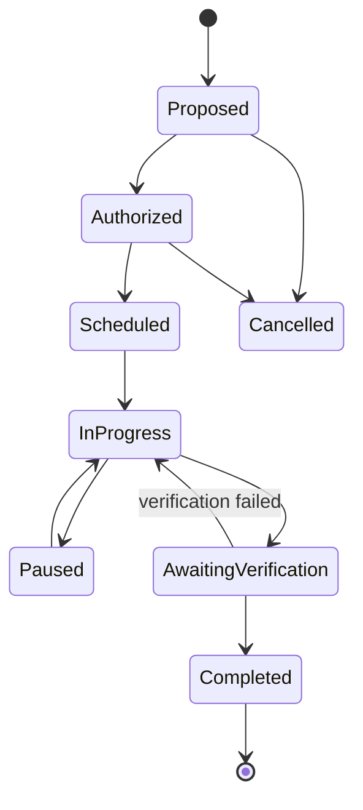

# Operation Model

Version: 2.0  
Status: Architecture Baseline

## Purpose

The Operation model describes work performed to understand, stabilize, resolve, verify, and learn from an Incident.

## Operation types

Inspection, emergency stabilization, corrective repair, preventive action, monitoring, verification, resident communication, procurement, and external-service coordination are explicit types. A type may add requirements but does not change the common accountability model.

## Lifecycle

State changes record actor, role, time, reason, authority where required, and affected commitments. `Completed` means the Operation scope was verified; it does not prove the Incident can close.

## Planning and execution

Each Operation declares scope, desired outcome, hazards, dependencies, Organizational Priority, applicable SLA, due commitment, responsible function, required Authority, Capability, evidence plan, and verification method. An SLA is a policy expectation; a due commitment is the boundary accepted or assigned for this specific work. Commitments are offered and accepted explicitly. Technicians choose Execution Sequence within safety rules, organizational priorities, deadlines, dependencies, and emergency overrides.

## Emergency autonomy

When delay could increase harm, capable technicians or duty staff may act before formal authorization or data entry within standing authority or necessity. They stabilize first, communicate when feasible, and reconstruct event time, action time, decisions, resources, evidence limitations, and consequences afterward. Retrospective review assesses learning and authority without falsifying chronology.

## Interruption and handover

A critical Incident may interrupt planned work. The interruption record identifies the authorized override or emergency rationale, paused commitment, safe stopping condition, schedule impact, notified parties, and recovery plan. Handover transfers current work context, not historical accountability.

## Verification and closure

Verification is independent from performance when risk or policy requires it. Remote verification is allowed only when the evidence standard and authority permit it; method and limitations are explicit. Failed verification returns work to `InProgress`. Incident closure requires its own human decision under [09_decision_model.md](09_decision_model.md).

## Recurrence

A later report never automatically reopens an Incident. Investigation compares location, asset/component, symptom, cause, relationship to repair, elapsed time, and evidence, then records a human determination: associate and reopen, create a new Incident, or remain unverified.
