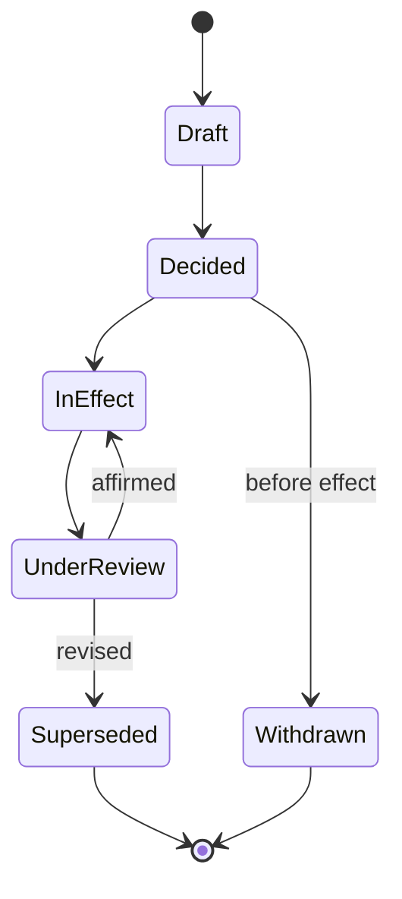
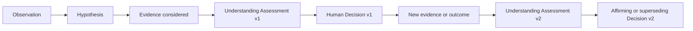

# Decision Model

Version: 2.0  
Status: Architecture Baseline

## Purpose

The Decision model makes consequential human choices explainable, reviewable, and durable.

## Decision Record

Every material decision records the question, context, observations, hypotheses, evidence considered and omitted, alternatives, recommendation sources, decision, responsible human, acting role, authority source, decision time, recording time, rationale, constraints, expected consequences, affected commitments, dissent, review date, and supersession relationship.

## Decision classes

Operational decisions include Incident verification, Case association, priority, assignment, emergency override, verification, closure, reopen, and recurrence classification. Governance decisions include policy, delegation, retention, supplier, security risk, and architecture. The decision class determines required authority and review.

## Lifecycle

## Revised understanding

New evidence creates a new assessment and, if action changes, a new Decision Record that cites the earlier one. The previous decision remains correct as a record of what was decided with information then available, even when later judged mistaken.

## Decision Evolution chain

The chain preserves negative and missing evidence, rejected hypotheses, dissent, and the policy/workflow version in force. An assessment can change without a new operational decision; when it does, it still cites the previous assessment and explains the difference. A decision may be superseded only by a human or body holding Authority for the same scope.

## Emergency decisions

Urgent action may precede a formal record. Retrospective capture identifies actual action time, available information, necessity, actor capability, authority or emergency rationale, and later reviewer. Review must not falsify prior approval.

## Conflicts and appeals

Conflicts of interest are disclosed. Appeals append a challenge and route it to a different authorized reviewer where practical. Dissent is preserved. AI may structure options but cannot be the decider or authority source.

## Architecture decisions

Architecture-specific requirements and template are in [17_architecture_decision_records.md](17_architecture_decision_records.md). All decision types use terminology from [16_project_glossary.md](16_project_glossary.md). Investigation assessments and Incident identity follow [02_domain_model.md](02_domain_model.md); event representation follows [19_event_architecture.md](19_event_architecture.md).
