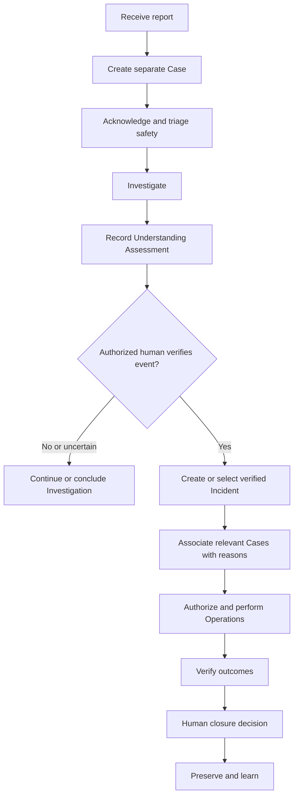

# Workflow Model

Version: 2.0  
Status: Architecture Baseline

## Purpose

Workflows coordinate people without claiming that process order defines reality. They are versioned orchestration policies over domain state and immutable events.

## End-to-end workflow

## Workflow rules

Creation of a Case is atomic with report receipt. Similarity creates a suggestion only. Safety triage can invoke emergency action at any point. Incident association requires evidence, authority, and a reasoned human decision. Operations use explicit commitments and responsibility entries. Closure requires acceptance evidence appropriate to risk and communicates outcomes to affected Case participants.

An Investigation may conclude without an Incident when evidence does not verify an operational event. This conclusion does not invalidate the Case or reporter observation. If one report is later shown to describe two verified events, separate association decisions may connect its Case to both Incidents while preserving one reporter communication path.

## Exceptions

Offline work uses locally captured times and later synchronization. Danger may delay evidence. External work discovered after the fact is reconstructed with provenance rather than backdated. A participant may lack permission to view sensitive details but still receives an appropriate status explanation. Failed integrations retry idempotently and enter human-visible exception handling.

## Versioning

Every workflow instance records definition version. New versions apply prospectively unless an authorized migration decision specifies otherwise. In-flight instances may finish on the old version, migrate with recorded mapping, or be manually transitioned. Historical interpretation always uses the version active at the time.

## Ownership and monitoring

Each workflow has a business owner, policy authority, service objective, exception queue, and review cycle. Metrics identify delay and failure but do not become automatic personnel judgments. State rules are normative in [21_state_machine_catalog.md](21_state_machine_catalog.md).
