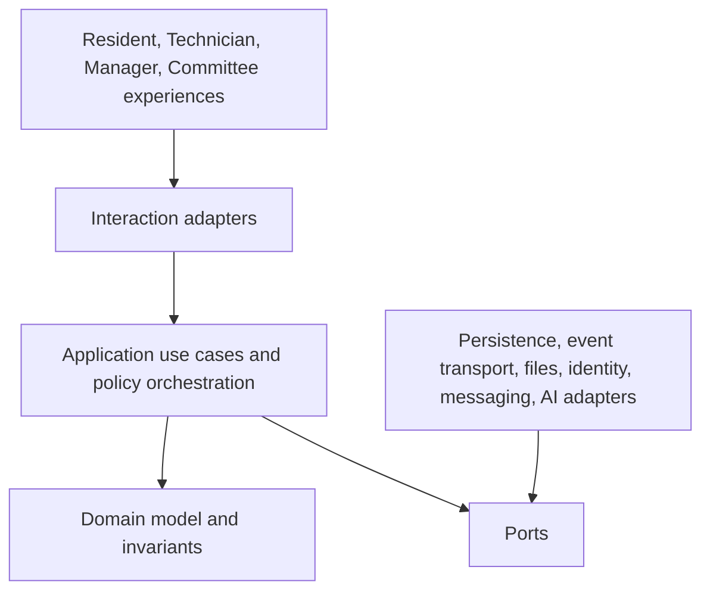
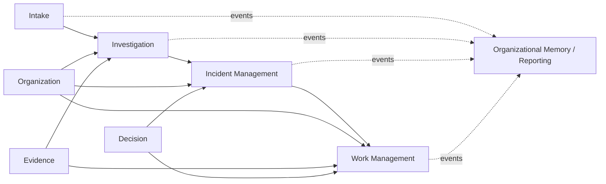

# System Architecture

Version: 2.0  
Status: Architecture Baseline

## Purpose

The system architecture applies Clean Architecture and Domain-Driven Design so that business rules remain independent from interfaces, vendors, and storage technologies.

## Logical architecture

Dependencies point inward. Domain objects do not depend on frameworks, database schemas, message brokers, AI providers, or user interfaces.

## Deployable boundaries

Begin as a modular system with enforced modules for Intake, Investigation, Work, Organization, Evidence, Decision, Knowledge, Notification, Identity/Access, and Memory/Reporting. Modules own writes and publish versioned events. Extraction into services is justified only by scale, isolation, team ownership, or regulatory need.

Incident Management is a distinct domain module between Investigation and Work. Investigation owns hypotheses and Understanding Assessments; Incident Management owns verified Incident identity and Case-Incident Association history. Memory/Reporting consumes context-owned records and events but cannot write back a competing version of Case, Incident, Operation, Evidence, or Decision state.

## Consistency

Aggregate transactions enforce local invariants. Cross-module processes use events, idempotent handlers, durable outboxes, and compensating decisions. No distributed transaction is assumed. Current projections may be eventually consistent and must display staleness when consequential.

## Availability and degradation

Core report capture and emergency work reconstruction remain available without AI. Offline technician capture synchronizes later. Messaging, analytics, search, and AI failures do not corrupt authoritative operations. Evidence uploads support resumability and integrity verification.

## Quality attributes

Priority order is safety, correctness and auditability, security/privacy, recoverability, availability, usability, interoperability, performance, and cost—adjusted by explicit risk decisions. Architecture fitness checks verify module dependencies, event compatibility, authorization coverage, immutable history, and restore ability.

## Evolution

Adapters are replaceable, contracts versioned, and migrations reversible or coexistence-based. Bounded-context meaning is defined in [02_domain_model.md](02_domain_model.md); the concrete deployment view is in [30_reference_architecture.md](30_reference_architecture.md).
