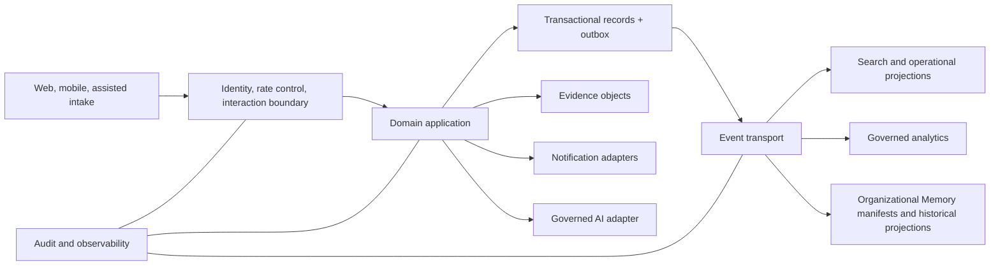

# Reference Architecture

Version: 2.0  
Status: Architecture Baseline

## Purpose

The reference architecture maps the logical model to deployable capabilities while remaining vendor-neutral and implementation-independent.

## Capability view

## Trust boundaries

Client devices, external identity, notification providers, AI providers, building systems, and contractor systems are separate trust zones. Each integration authenticates, authorizes, validates, minimizes, rate-controls, observes, and translates external semantics through an anti-corruption layer.

## Deployment qualities

The authoritative domain application and transactional store use high availability appropriate to operational risk. Evidence storage uses immutable versions and integrity checks. The event transport supports durable at-least-once delivery. Search and analytics are rebuildable. Backups are isolated and restore-tested. Regions, residency, and recovery placement follow governance.

## Operational modes

Normal mode supports all capabilities. Degraded mode preserves report capture, current commitments, and emergency reconstruction while AI, analytics, search, or messaging may be unavailable. Offline mode assigns durable client identities and synchronizes through idempotent commands with explicit conflict handling.

## Ownership

Every capability has a business owner, technical steward, service objective, data classification, runbook, dependency map, recovery objective, and exit strategy. Vendors do not own domain identifiers or Organizational Memory.

Organizational Memory is reconstructed from context-owned authoritative records, immutable events, evidence manifests, and Decision/Responsibility relationships. Its projections are replaceable; its retention, lineage, export, and integrity controls are not.

## Conformance

Implementation must demonstrate domain dependency direction, tenant isolation, authorization coverage, append-only history, event compatibility, AI bypass, evidence integrity, observability, and successful export/restore before production acceptance.
