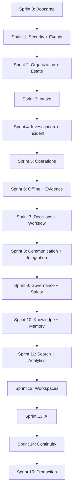

# O83 Care Implementation Dependency Graph

Version: 1.0  
Status: Execution Baseline

## Purpose

This document defines predecessor relationships for every feature and proves that no sprint depends on a future sprint. A dependency means the predecessor's published contract and acceptance tests must pass; it does not require every later enhancement to be complete.

## Dependency rules

- Platform, migration, identity, tenant isolation, audit, and event foundations precede domain mutation.
- Organization, Authority, property, asset, and taxonomy context precede operational records that reference them.
- A Case precedes Investigation; an authorized human Decision and Assessment precede Incident creation.
- An Incident or Maintenance Plan precedes Operation origin; Operations precede Commitments and verification.
- Evidence intake precedes issued packages; Evidence and Assessments precede consequential Decisions.
- Notifications, integrations, search, analytics, Organizational Memory, and AI consume versioned domain contracts; they do not own domain state.
- Role workspaces integrate only features completed in prior sprints.
- Production rollout depends on continuity, recovery, security, and operational evidence rather than document approval alone.

## Feature predecessor matrix

| Feature | Direct predecessors | Sprint | Dependency rationale |
|---|---|---:|---|
| F01 | None | 0 | Repository and delivery foundation |
| F02 | F01 | 0 | Database executed through controlled environments |
| F03 | F01, F02 | 1 | Telemetry attaches to deployed platform and database |
| F04 | F02 | 1 | Auth mapping requires the live schema |
| F05 | F03, F04 | 1 | Authorization requires identity and denial telemetry |
| F37 | F02, F03, F05 | 1 | Durable events/audit require database, context, and actor security |
| F06 | F04, F05, F37 | 2 | Parties and roles need identity, isolation, and audit |
| F07 | F06 | 2 | Mandates grant scoped Authority to organization relationships |
| F08 | F06, F07 | 2 | Duty, capability, availability, and handover need parties and Authority |
| F09 | F05, F06 | 2 | Occupancy joins managed property to durable parties |
| F10 | F09, F11 | 2 | Assets and plans require places and governed types |
| F11 | F05, F37 | 2 | Governed vocabulary requires tenant security and history |
| F12 | F06, F09, F11 | 3 | Reports require participant, location, and category context |
| F13 | F07, F08, F12 | 3 | Emergency triage needs standing Authority and escalation responsibility |
| F14 | F12, F13 | 3 | Case correction/transfer starts from immutable Report/Case identity |
| F40 | F05, F12, F14 | 3 | Resident portal is a purpose-limited Case projection |
| F16 | F14, F08, F10 | 4 | Investigation requires Cases, qualified actors, and asset context |
| F17 | F16 | 4 | Assessments may begin without media; evidence links are additive later |
| F18 | F07, F17 | 4 | Incident verification requires Authority and an Assessment |
| F19 | F18, F11 | 4 | Classification/reopen applies to a verified Incident |
| F20 | F10, F18 | 5 | Reactive or proactive work needs Incident or Maintenance Plan origin |
| F21 | F08, F20 | 5 | Work Steps and Commitments require Operation scope and actors |
| F22 | F07, F21 | 5 | Priority, sequence, interruption, and dissent require work context |
| F23 | F11, F14, F20 | 5 | Versioned SLA applies to Case/Operation scope |
| F41 | F05, F16, F20, F21, F22 | 5 | Field workspace integrates assigned operational context |
| F24 | F37, F41 | 6 | Offline commands require idempotent events and field workflow |
| F25 | F05, F12, F20 | 6 | Upload intents require authorized Case/Operation context |
| F26 | F25, F37 | 6 | Provenance/custody starts after controlled upload and audit |
| F27 | F21, F26 | 6 | Issued packages and verification require work criteria and Evidence |
| F28 | F07, F17, F26, F27 | 7 | Decisions bind Authority to Assessments and Evidence |
| F29 | F14, F18, F20, F28 | 7 | Workflow orchestrates existing aggregates and decisions |
| F15 | F14, F28, F29 | 8 | Disputes require Case history, review decisions, and workflow |
| F30 | F14, F29, F37 | 8 | Notification intents originate from durable domain events |
| F31 | F24, F30, F37 | 8 | External adapters require conflict, idempotency, and delivery foundations |
| F32 | F06, F07, F28, F29 | 9 | Governance actions require memberships, Authority, Decisions, workflow |
| F33 | F06, F21, F28, F32 | 9 | Supplier obligations and substitution need parties, commitments, governance |
| F34 | F10, F13, F22, F27, F28, F32 | 9 | Major incidents and return-to-service combine safety, assets, evidence, decision rights |
| F35 | F17, F26, F28 | 10 | Knowledge derives from verified outcomes, Evidence, and Decisions |
| F36 | F35, F37 | 10 | Memory manifests index governed records and immutable lineage |
| F46 | F26, F32, F36 | 10 | Retention/disposition needs Evidence, policy Authority, and manifests |
| F38 | F14, F18, F20, F26, F28, F36 | 11 | Search projects authoritative domains and memory lineage |
| F39 | F23, F35, F37, F38 | 11 | KPIs require versioned measures, outcomes, lineage, and projections |
| F42 | F15, F29, F30, F33, F34, F38, F39 | 12 | Manager workspace integrates completed operational capabilities |
| F43 | F32, F33, F34, F39 | 12 | Committee workspace integrates governance and governed analytics |
| F44 | F05, F32, F35, F38, F46 | 13 | AI governance needs approved use cases, controlled retrieval, retention |
| F45 | F44, F42, F43 | 13 | AI advice is reviewed within established human workspaces |
| F47 | F24, F30, F31, F34, F36, F46 | 14 | Continuity covers offline, providers, safety command, restore, retention |
| F48 | All F01–F47 | 15 | Production assurance validates the complete socio-technical system |

`F17` deliberately has no hard dependency on F25. An Investigation can preserve observations and uncertainty when media is unavailable; Evidence links become available after Sprint 6 without rewriting the earlier Assessment.

## Sprint dependency graph

## Contract dependencies

| Contract | First producer | First consumers | Compatibility rule |
|---|---|---|---|
| Identity/acting-context | F04–F05 | Every authenticated feature | Additive claims only; database remains authoritative |
| Domain event envelope | F37 | F30, F31, F36, F38, F39 | Versioned, at-least-once, idempotent consumers |
| Party/Authority references | F06–F08 | Intake, work, decisions, governance | Effective-dated IDs; never infer Authority from role name |
| Property/Asset context | F09–F10 | Intake, investigation, work, knowledge | Durable IDs and effective history; labels may change |
| Report/Case contract | F12–F14 | Investigation, notifications, resident, analytics | One Report/one Case; corrections append assertions |
| Assessment/Incident contract | F17–F19 | Operations, Decisions, analytics, AI | Human verification and immutable association history |
| Operation/Commitment contract | F20–F23 | Evidence, vendor, manager, KPI | Keep priority, SLA, sequence, capability, availability separate |
| Evidence contract | F25–F27 | Decisions, knowledge, governance, AI | Originals immutable; renditions and links explicit |
| Decision/workflow contract | F28–F29 | Disputes, governance, knowledge, UI | Supersession appends; state transitions immutable |
| Memory/search/report contract | F35–F39 | Workspaces and AI | Rebuildable projection with source lineage and as-of time |

## Cycle and future-dependency validation

No feature in S0–S14 lists a predecessor from a higher-numbered sprint. Cross-domain references that would create deployment cycles are handled by the approved SQL order—tables before constraints—or by durable events and later projections. Evidence can enrich earlier Investigations without becoming a prerequisite for recording evidence absence. Analytics and AI are terminal consumers and cannot write Operational Truth. Production assurance is the only feature depending on the entire preceding program.
