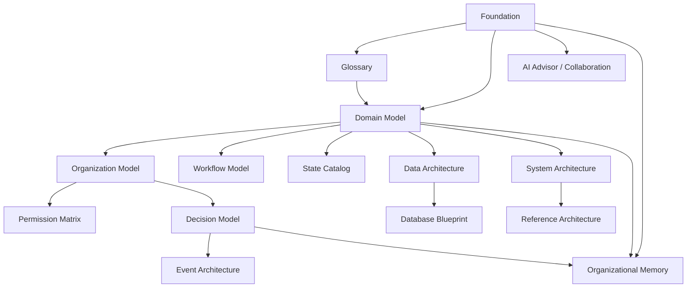

# Cross-Reference Report

Version: 1.0  
Status: Passed

## Purpose

This report validates both physical Markdown links and semantic consistency between authoritative models and consuming documents.

## Physical link validation

- Architecture Markdown files scanned: 32
- Broken `.md` links: 0
- Missing required numbered files: 0
- Empty Markdown files: 0
- Incomplete-marker matches: 0

## Normative reference graph

## Key semantic checks

| Concept | Normative source | Consuming views | Result |
|---|---|---|---|
| Operational Truth | Foundation and Glossary | Decision, Knowledge, Analytics, UI | Consistent |
| Case identity | Domain Model | Workflow, Database, Resident, Manager | Consistent |
| Verified Incident | Domain Model and State Catalog | Workflow, Events, Analytics, AI | Consistent after correction |
| Case-Incident Association | Domain and Decision Models | Workflow, Database, Events | Consistent after strengthening |
| Responsibility Chain | Organization and Domain Models | Foundation, Glossary, Data | Consistent after strengthening |
| Decision Evolution | Decision Model | Foundation, Glossary, Events, Data | Consistent after strengthening |
| Organizational Memory | Foundation and Governance | Domain, Data, System, Reference | Consistent; no duplicate write authority |
| AI boundary | AI Advisor and Collaboration | UI, Workspaces, Analytics | Consistent; approval/rejection prohibited |
| Emergency chronology | Operation and Workflow | Evidence, Technician, Data, States | Consistent |

## Result

Passed. The repository has no broken physical references and no remaining semantic reference conflict identified during review.
