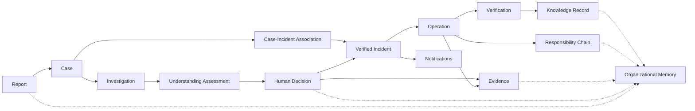

# End-to-End Traceability Report

Version: 1.0  
Status: Passed with Critical Link Gaps

## Purpose

This report verifies that engineers can trace operational meaning across intake, investigation, decisions, work, evidence, responsibility, communication, reporting, knowledge, and long-term memory.

## Primary traceability chain

Every arrow represents a durable identifier or relationship record, not a textual coincidence.

## Traceability questions

| Question | Required path | Result |
|---|---|---|
| Which original Report created this Case? | Case → Report | Complete, exactly one-to-one |
| Why does this Case relate to this Incident? | Association → Decision → Assessment → Evidence → Case/Incident | Complete conceptually |
| What did the organization believe at that time? | Scope/as-of → Assessment version → known/inferred/disputed/unknown | Complete conceptually |
| Why was this Incident created? | Incident → verification Decision → Authority + Assessment | Complete |
| What work addressed the Incident? | Incident → Operations → Commitments/Actions/Verification | Complete |
| Who was responsible and authorized? | Action/Decision → Responsibility Assignment + Mandate + acting role | Complete conceptually |
| Why did work interrupt another commitment? | Interruption → override/emergency rationale → affected Commitments | Complete |
| Which evidence supported or challenged a claim? | Claim/Evidence Link → Evidence Item → provenance/renditions/custody | Link entity needs formalization |
| What changed after new evidence? | Evidence → new Assessment → affirming/superseding Decision → consequences | Complete |
| Which residents were told what? | Case Party → Notification Intent → rendered version → Delivery Attempts | Case Party model missing |
| Which SLA applied and how was time calculated? | Scope → classification → SLA version/calendar/pause events | Critical gap |
| Which Asset/Component and historical context applied? | Operation/Observation → Asset/Component/location/model/effective history | Critical gap |
| Which Contract/Vendor obligation applied? | Operation/Commitment → Contract version/obligation/Vendor | Critical gap |
| How did a Knowledge recommendation derive from outcomes? | Knowledge → source Decisions/Operations/Outcomes/Evidence + Validity Context | Complete except Asset taxonomy |
| Was an AI recommendation adopted? | AI Recommendation → reviewer action → human Decision → outcome | Complete conceptually |
| Can an issued KPI be reproduced? | KPI Observation → definition version → source snapshot/lineage/dimensions | Partial due missing dimensions |
| Can a full export be proven complete? | Memory Manifest → records/events/evidence/schema/policy/taxonomy versions | Complete conceptually |

## Weak traceability points

- Party, occupancy, property, location, Asset, Component, Vendor, Contract, and taxonomy identities are not normatively defined.
- Attachment-to-Evidence promotion and quarantine outcome lack an explicit link.
- Generic Recommendation and Work Step/Task do not have fixed ownership or lifecycle.
- Workflow Instance correlation across multiple aggregates is stated but not cataloged by process type.
- Evidence-to-claim links and considered/omitted evidence links need stable relationship identities.
- External identifier aliasing and replacement history require a general identity-reference pattern.

## Duplicate-concept prevention

- Lesson Learned is a Knowledge Record subtype, not a second knowledge aggregate.
- Inspection and Corrective Maintenance are Operation types.
- Preventive Maintenance is an Operation type only after proactive work is modeled without a fake Incident.
- Decision Revision is a new Decision plus typed supersession relationship, never an edited Decision.
- Operational Truth, Responsibility Chain, Timeline Event, Historical Projection, and KPI Observation are derived/reproducible views or snapshots, not competing mutable truth.
- Resident, Staff, and Technician are roles/relationships of Person, not copied person identities.
- Attachment is an intake/media role and must not silently equal verified Evidence.

## Traceability score

Traceability: **88/100**. The operational core is strong; property/assets, parties/transfers, contracts/SLA, evidence intake, and taxonomy gaps prevent complete end-to-end database traceability.
